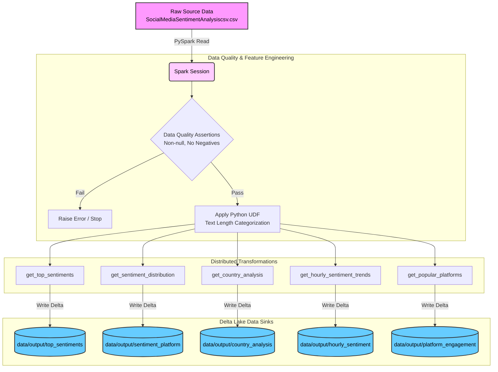

# Social Media Sentiment Analysis - Production PySpark Pipeline 🚀

This repository contains an industry-standard, production-ready PySpark application for analyzing social media sentiment data. It has been meticulously refactored from an experimental Jupyter Notebook into an elite Data Engineering pipeline utilizing Databricks-style **Delta Lake** storage formats, **Custom PySpark Feature Engineering**, strict **Data Quality Assertions**, and **CI/CD Automation**.

## 🏗️ Architecture Workflow



## 📂 Project Structure
```text
├── .github/workflows/
│   └── spark_ci.yml          # GitHub Actions CI/CD Pipeline
├── config/
│   └── config.json           # Input paths and PySpark configurations
├── src/
│   ├── jobs/
│   │   └── sentiment_analysis.py  # Core Spark DataFrame transformations
│   ├── utils/
│   │   ├── spark_utils.py    # SparkSession logic 
│   │   ├── data_quality.py   # Row & schema validations
│   │   └── udfs.py           # Custom Feature Engineering
│   └── main.py               # Application entry point
├── tests/
│   ├── conftest.py           # PyTest fixtures (local SparkSession)
│   └── test_sentiment_analysis.py # Unit tests for the jobs
├── data/
│   └── output/               # Local Delta Lake tables
├── Dockerfile                # Container execution environment
├── Makefile                  # Local automation commands
└── requirements.txt          # Python dependencies
```

## 🛠️ Setup and Installation

### Local Execution (Via Makefile)
This project uses a Makefile to abstract execution logic. Ensure you have Python 3.8+ and Java 11 installed.

1. **Install Dependencies:**
   ```bash
   make install
   ```

2. **Run the Delta Pipeline:**
   Reads the CSV, enforces Data Quality, applies UDFs, runs 5 distributed jobs, and generates Delta Lake directories locally.
   ```bash
   make run
   ```

3. **Run Unit Tests:**
   Verifies functional correctness of distributed logic using mocked DataFrames.
   ```bash
   make test
   ```

4. **Clean Workspace:**
   Removes built Delta directories and PySpark metastores.
   ```bash
   make clean
   ```

## 📦 Delta Lake Analysis Outputs
Unlike standard tutorials, this pipeline does not write slow CSVs. It generates transactional, ACID-compliant Delta tables in `data/output/`:
1. **Top Sentiments** (`output_top_sentiments`): Top 10 Sentiments by average Likes and Retweets.
2. **Sentiment Distribution** (`output_sentiment_platform`): Sentiment count segmented by platform.
3. **Country Analysis** (`output_country_analysis`): Average engagement metrics grouped by country.
4. **Hourly Trends** (`output_hourly_sentiment`): Sentiment fluctuations across different hours of the day.
5. **Platform Engagement** (`output_platform_engagement`): Popularity based on total likes and retweets per platform.

## 🛳️ CI/CD and Docker
- **Continuous Integration:** Whenever code is pushed to the `main` branch, a GitHub Action spins up an Ubuntu environment, installs Java and PySpark, and runs the `pytest` suite automatically.
- **Docker:** A `Dockerfile` is provided for containerized deployment to clusters (like Databricks or Kubernetes).
