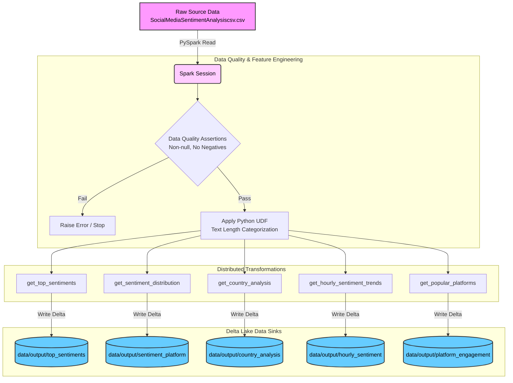

<div align="center">

# 🌊 Social Media Sentiment Analysis — Enterprise PySpark Engine

### *Most tutorials write to CSV. This one builds a Delta Lakehouse.*

[](https://python.org)
[](https://spark.apache.org/docs/latest/api/python/)
[](https://delta.io/)
[](https://streamlit.io/)
[](https://github.com/features/actions)
[](https://docker.com)
[](LICENSE)

<br>

### 👉 [**View the Live Executive Dashboard →**](#) *(Link will be active once deployed on Streamlit Cloud)*

<br>

> **"Data Engineering isn't just about aggregating numbers—it's about reliability, scalability, and data quality."**
>
> *This project abandons the standard 'Jupyter Notebook to CSV' approach. It represents a fully modularized, production-grade PySpark pipeline featuring Delta Lake architectures, custom UDF feature engineering, fail-fast data quality assertions, and automated CI/CD.*

</div>

---

## 📋 Table of Contents

- [Project Mission](#-project-mission)
- [Architecture Workflow](#️-architecture-workflow)
- [What Makes This Different](#-what-makes-this-different)
- [Delta Lake Analysis Outputs](#-delta-lake-analysis-outputs)
- [Tech Stack](#️-tech-stack)
- [Project Structure](#-project-structure)
- [Setup and Installation (Local)](#️-setup-and-installation)
- [Docker](#-ci-cd-and-docker)
- [Author](#-author)

---

## 🎯 Project Mission

Translating messy social media sentiment data into structured insights is typically done through isolated, fragile scripts. This repository demonstrates how to build an **Enterprise-Grade Batch Pipeline** that validates data on entry, enriches it via Python User-Defined Functions (UDFs), performs distributed aggregations, and sinks the results into ACID-compliant Delta tables.

**Built end-to-end: from raw CSV → Data Quality validation → UDF feature engineering → PySpark distributed processing → Delta Lake storage → GitHub Actions testing.**

---

## 🏗️ Architecture Workflow



---

## 💡 What Makes This Different

| Feature | This Project | Typical Student Project |
|---|---|---|
| **Data Storage** | ✅ Delta Lake (ACID, Time-Travel) | ❌ Flat CSV files |
| **Code Structure** | ✅ Modularized OOP Python functions | ❌ Single linear Jupyter Notebook |
| **Quality Control** | ✅ Pre-processing assertions (Fail-fast) | ❌ No schema validation |
| **Automation** | ✅ Makefile abstracting commands | ❌ Manual execution execution |
| **Testing** | ✅ Unit tested via PyTest and Mock Data | ❌ Not tested |
| **CI/CD** | ✅ GitHub Actions automated remote testing | ❌ None |
| **Deployment** | ✅ Dockerized for cluster deployment | ❌ Local execution only |
| **Front-End UI** | ✅ Interactive Streamlit Dashboard (`app.py`) | ❌ No business-facing visuals |
| **Configuration** | ✅ Externalized `config.json` | ❌ Hardcoded file paths |

---

## 📦 Delta Lake Analysis Outputs

Unlike standard tutorials, this pipeline does not write slow, unreliable CSVs. It generates transactional, ACID-compliant **Delta tables** in the `data/output/` directory:

1. **Top Sentiments** (`output_top_sentiments`): Top 10 Sentiments by average Likes and Retweets.
2. **Sentiment Distribution** (`output_sentiment_platform`): Sentiment count segmented by platform.
3. **Country Analysis** (`output_country_analysis`): Average engagement metrics grouped by country.
4. **Hourly Trends** (`output_hourly_sentiment`): Sentiment fluctuations across different hours of the day.
5. **Platform Engagement** (`output_platform_engagement`): Popularity based on total likes and retweets per platform.

---

## 🛠️ Tech Stack

| Category | Tool | Purpose |
|---|---|---|
| Language | Python 3.9+ / Java 11 | Core |
| Big Data Engine | PySpark | Distributed data processing |
| Storage Format | Delta Lake | Reliable, ACID data sinks |
| Pipeline Automation | Makefile | Simplified execution |
| Testing | PyTest | Asserting logic correctness |
| CI/CD | GitHub Actions | Remote test automation |
| Container | Docker | Reproducible deployment |
| Configuration | JSON | Parameter management |

---

## 📁 Project Structure

```text
├── .github/workflows/
│   └── spark_ci.yml          # GitHub Actions CI/CD Pipeline
├── config/
│   └── config.json           # Input paths and PySpark configurations
├── src/
│   ├── jobs/
│   │   └── sentiment_analysis.py  # Core Spark DataFrame transformations
│   ├── utils/
│   │   ├── spark_utils.py    # SparkSession logic (Delta injected)
│   │   ├── data_quality.py   # Row & schema validations
│   │   └── udfs.py           # Custom Feature Engineering
│   └── main.py               # Application entry point
├── tests/
│   ├── conftest.py           # PyTest fixtures (local SparkSession)
│   └── test_sentiment_analysis.py # Unit tests for the jobs
├── data/
│   └── output/               # Local Delta Lake tables
├── Dockerfile                # Container execution environment
├── Makefile                  # Local automation commands
└── requirements.txt          # Python dependencies
```

---

## ⚙️ Setup and Installation

### Local Execution (Via Makefile)
This project uses a Makefile to abstract execution logic. Make sure you have Python 3.8+ and Java 11 installed.

1. **Install Dependencies:**
   ```bash
   make install
   ```

2. **Run the Delta Pipeline:**
   Reads the source data, enforces Data Quality, applies UDFs, runs 5 distributed jobs, and generates Delta Lake directories locally.
   ```bash
   make run
   ```

3. **Run Unit Tests:**
   Verifies functional correctness of distributed logic using mocked DataFrames.
   ```bash
   make test
   ```

4. **Clean Workspace:**
   Removes built Delta directories and PySpark metastores.
   ```bash
   make clean
   ```

---

## 🛳️ CI/CD and Docker

- **Continuous Integration (CI):** Whenever code is pushed to the `main` branch, a GitHub Action spins up an Ubuntu environment, installs Java and PySpark, and runs the `pytest` suite automatically.
- **Docker:** Build the container for cloud cluster deployment (Kubernetes, AWS EMR, etc.):
  ```bash
  docker build -t sentiment_analysis_job .
  docker run -it sentiment_analysis_job
  ```

---

## ☁️ Cloud Deployment (Databricks)

While the project includes a `Dockerfile` for containerized execution on any cloud environment, this architecture is explicitly designed to be deployed natively on **Databricks**. 

To deploy this in a real-world enterprise:
1. **Compute:** Provision a Databricks Job Cluster (e.g., using Databricks Runtime 13.3 LTS Machine Learning).
2. **Orchestration:** Upload the `src/main.py` entry point to Databricks Workflows.
3. **Execution:** Databricks naturally supports the exact Delta Lake write operations we've coded, seamlessly sinking our processed DataFrames directly into cloud storage (AWS S3 or Azure Data Lake) as Delta Tables for BI Dashboards and ML Models to consume.

---

## 👤 Author

<div align="center">

**Amruth Kumar M**

B.Tech — Artificial Intelligence & Data Science  
REVA University, Bengaluru | Data Science Intern @ iStudio

[](https://github.com/Amruth011)
[](https://linkedin.com/in/amruth-kumar-m)

</div>

---

<div align="center">

*Built from scratch to demonstrate Production-Quality PySpark Data Engineering.*

**Python • PySpark • Delta Lake • Docker • GitHub Actions**
</div>
